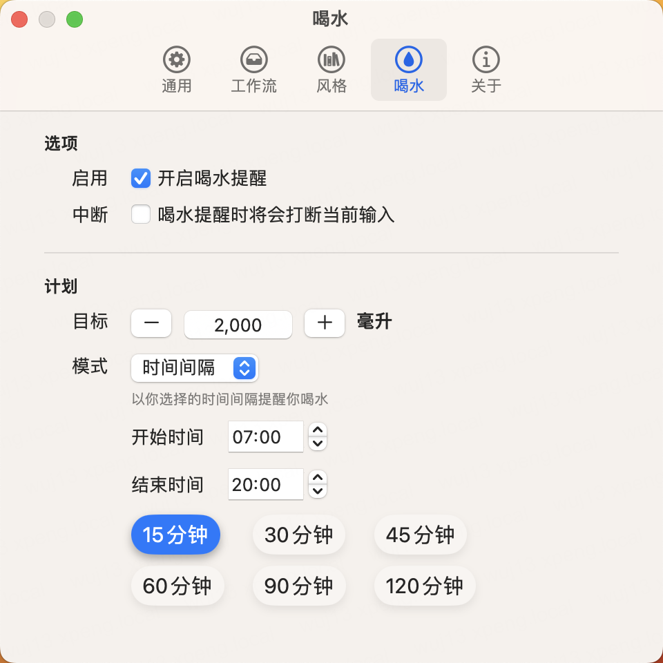

# 木鱼：提升工作效率与健康的完美结合

在现代快节奏的生活中，时间管理和健康成为了越来越重要的话题。许多人在工作时感到焦虑，也常常忽视了自己的健康。但是，有一款名为"木鱼"的应用程序，它巧妙地将番茄工作法与喝水提示功能结合在一起，为用户提供了一种完美的解决方案，既能提升工作效率，又能保持健康。

## 番茄工作法：工作效率的秘诀

"木鱼"应用内置了番茄工作法，这是一种被广泛认可的时间管理技巧。它将工作时间划分为短暂的工作周期，通常为25分钟，每个工作周期称为一个"番茄时间"。在每个番茄时间结束后，应用会提醒你休息5分钟，然后再开始下一个番茄时间。每4个番茄时间后，你可以休息长一些，约15-30分钟。这种有节奏的工作方式有助于提高专注力和生产力，减少工作中的焦虑感。

    
    
    

## 喝水提醒功能：保持身体健康

另一个"木鱼"应用的独特之处在于它的喝水提示功能。不仅仅是一款时间管理工具，它还是一位贴心的健康伴侣。应用会定时提醒你喝水，以确保你保持良好的饮水习惯。你可以根据自己的需求和喜好自定义提醒频率和每次饮水的水量。此外，"木鱼"还提供了统计信息，让你了解自己的饮水表现，帮助你保持身体健康。

    
    

## 定制化设置

"木鱼"应用非常注重用户的个性化设置。你可以根据自己的工作和生活需求，自定义番茄时间的时长、休息时间以及提醒频率。同时，你可以设置每天的饮水目标，应用将帮助你实现健康的饮水计划。这种高度的定制化使得"木鱼"适用于各种不同的用户和工作场景。

    
    
    

## 管理时间与健康，一举两得

"木鱼"应用是一款独特的工具，它不仅能够提高工作效率，还能够关注你的健康。通过结合番茄工作法和喝水提示功能，它帮助用户更好地管理时间、保持专注，并且保持身体健康。无论你是一个忙碌的职业人士、一名学生还是任何需要提高工作效率和健康的人，"木鱼"都能为你提供帮助。

如果你也希望在工作中更高效，同时关注自己的健康，不妨尝试一下"木鱼"应用，它可能会成为你的理想助手。下载并安装"木鱼"应用，开始体验更有节奏的工作和更健康的生活吧！
