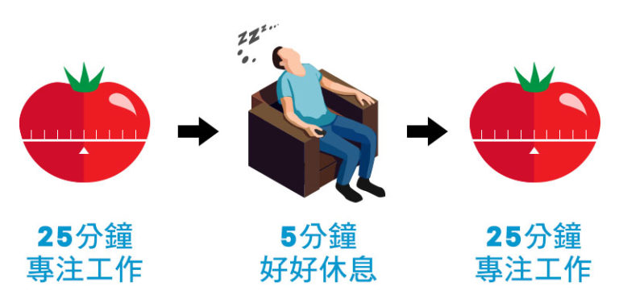

# 番茄工作法：提高工作效率的时间管理技巧

 <!-- 插入一张相关的图片 -->

番茄工作法，也称为“Pomodoro Technique”，是一种简单而有效的时间管理方法，可以帮助你提高工作效率，更好地管理时间，以及减少工作中的压力。

## 如何工作

番茄工作法的基本概念很简单：

1. 选择一个任务，开始计时器（通常为25分钟）。

2. 专注于这个任务，不要分心，直到计时器响铃。

3. 休息5分钟，用于放松和休息。

4. 重复上述步骤，每完成4个“番茄”（工作时间段），休息更长时间（通常15-30分钟）。

## 为什么番茄工作法有效

番茄工作法之所以有效，因为它利用了人的生产力周期。25分钟的工作时间段有助于保持高度的专注，而短暂的休息可以帮助你保持精力充沛。此外，番茄工作法还有以下优点：

- 帮助你战胜拖延症，因为你知道你只需要集中精力工作25分钟。
- 通过记录番茄的数量，你可以追踪你的工作进度。
- 提高了自我管理和时间管理的能力。

## 如何开始使用番茄工作法

1. 选择一个番茄计时器应用或工具，或者使用一个简单的倒计时器。

2. 列出你需要完成的任务清单。

3. 选择一个任务，开始番茄工作法。

4. 在25分钟内尽量不要中断。

5. 休息5分钟，然后继续下一个番茄。

6. 定期休息更长时间，以确保你保持高效。

## 结语

番茄工作法是一种简单却非常实用的时间管理技巧，它可以帮助你提高工作效率，减少压力，更好地管理时间。开始使用番茄工作法，让你的工作变得更加有组织和高效！

如果你想提高工作效率，不妨试试番茄工作法，它可能会改变你的工作方式。

